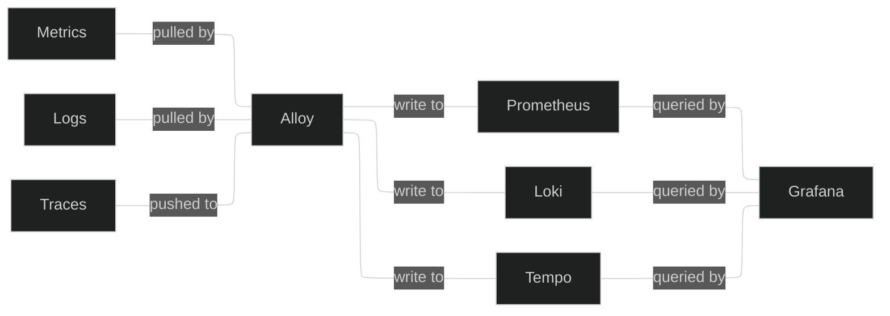

+++
title = "Home server observability 101"
date = "2025-12-10T20:57:00+13:00"
#dateFormat = "2006-01-02" # This value can be configured for per-post date formatting
description = "In my [previous post](/posts/beyla) I wrote a bit about how I monitor my home server, and how I use Grafana Beyla to get traces and metrics from services with no existing telemetry.\n\nThis time, I'm going to go through how to set up your own observability stack for home server scale, and how to start collecting metrics, logs, and traces."
showFullContent = false
readingTime = false
hideComments = false
+++
In my [previous post](/posts/beyla) I wrote a bit about how I monitor my home server, and how I use Grafana Beyla to get traces and metrics from services with no existing telemetry.

This time, I'm going to go through how to set up your own observability stack for home server scale, and how to start collecting metrics, logs, and traces. I'll be showing a mix of running on the node and running in Docker containers, but you can run everything on metal or everything in Docker if you wish.
## Why bother?
If you're running a homelab, you're probably somewhat interested in monitoring already - it's an important part of operating actual systems, and the whole point of homelabbing is to ~~burn money~~ learn new things.

For home server folks, you might sit in the same category as above, but it can still be pretty useful in practice. It's pretty annoying to sit down to watch a movie only to find out your server has fallen over (ask me how I know), so having robust monitoring can alert you before issues happen, and help you diagnose them when they do.

The last reason is because graphs are cool. More graphs is more good.
## Telemetry signals and standards
We're going to put together an observability stack for the three main telemetry signals - metrics, logs, and traces (MLT). There's also profiles, but I'm not particularly interested in continuous profiling.
- Metrics are numeric data points, measured over time - think CPU usage, memory usage, etc.
  
- Logs are... logs, timestamped textual messages from software describing errors, changes in state, etc.
  
- Traces are a representation of what happens during the life of a network request in an application, and how long processing that request takes. A trace is comprised of spans, which measure individual units of work - one HTTP call, one database call, etc.

These three signals provide a huge amount of insight into the functioning of an application, and linking them together is incredibly useful for debugging issues. A metric might tell you that request latency is increasing, a log might give you some insight into whether any errors or timeouts are occurring, and a trace might tell you exactly where in the request lifecycle the increased latency is.

There's quite a few standards for these signals, including some long-running proprietary players like Datadog and New Relic, and more recent open standards like OpenTelemetry. While OTel is really exciting and nicely unifies all these signals, we're not going to look at a completely OTel stack - it can be quite a bit more complicated to operate at a small scale, but it's not too complicated to switch over if you want to.
## Components
Any good observability stack needs three core things:
- Collector(s) to collect, aggregate, and transform your signals.
  
- Databases to store all the data.
  
- Some software for dashboarding, querying, and exploring your data.

We're mainly going to be using [Grafana Labs' open-source stack](https://grafana.com/oss/) here:
- Our collector will be [Grafana Alloy](https://grafana.com/docs/alloy/latest/).
  
- For our metrics database, we're going to use [Prometheus](https://prometheus.io/), a time-honored classic. Grafana offers their own metrics DB called Mimir, and it's great, but it's primarily intended for large-scale deployments and is significantly more complex to operate.
  
- For logs, we'll be using [Grafana Loki](https://grafana.com/docs/loki/latest/). There's a lot of options in this space, but Loki works great all the way from small-scale to extremely large scale.
  
- For traces, we'll use [Grafana Tempo](https://grafana.com/docs/tempo/latest/). It's pretty new and designed for large scale, but it's not too complicated to operate for our needs, and integrates really well with the other software.
  
- Finally, for dashboards, querying, and exploring, we'll use [Grafana](https://grafana.com/docs/grafana/latest/). It's been around forever, and naturally integrates with everything else that Grafana Labs makes.

Here's a very simplified diagram of what we'll end up with:


## Databases
We're going to start by setting up our databases, Prometheus, Loki, and Tempo. We'll run these as Docker containers - Prometheus is very simple, and Grafana Labs provides some good compose files to start off with a local setup for Loki and Tempo.
### Prometheus
Setting up Prometheus is pretty simple, it just needs a small config file and a volume to store data on. Here's the compose file I use:
```yaml
services:
  prometheus:
    image: prom/prometheus:latest
    container_name: prometheus
    command: 
      - "--config.file=/etc/prometheus/prometheus.yml"
      - "--web.enable-remote-write-receiver"
    volumes:
      - data:/prometheus
      - /opt/prometheus:/etc/prometheus
    ports:
      - 9090:9090
    restart: unless-stopped
volumes:
  data:
```
You can mount your `/etc/prometheus` folder from wherever you like. Take note of the `--web.enable-remote-write-receiver` argument - this is to allow Alloy to push metrics to Prometheus, instead of Prometheus pulling them itself.

For the `prometheus.yml` file, it's pretty basic:
```yaml
global:
  scrape_interval: 15s
  evaluation_interval: 15s

scrape_configs:
  - job_name: 'prometheus'
    static_configs:
      - targets: ['localhost:9090']

rule_files:
  - "/etc/prometheus/rules/*.yml"
```
This configuration file just sets Prometheus to scrape its own metrics, and provides a location to import alerting rules from - we won't go too much into that though.

It's worth noting that Prometheus pretty much only stores things locally. If you want to use S3 or other remote storage, you may want to use Grafana Mimir instead.
### Loki
This is the compose file I use for Loki:
```yaml
services:
  loki:
    image: grafana/loki:latest
    container_name: loki
    command: -config.file=/etc/loki/loki.yaml
    volumes:
      - data:/tmp/loki
      - /opt/loki:/etc/loki
    ports:
      - 3100:3100
    restart: unless-stopped
volumes:
  data:
```
For the `loki.yaml` configuration file, I use [Grafana Labs' local config example](https://grafana.com/docs/loki/latest/configure/examples/configuration-examples/#1-local-configuration-exampleyaml). This configuration stores everything locally, but Loki does have support for S3 and a pile of other remote storage options.
### Tempo
Here's my compose file for Tempo:
```yaml
services:
  tempo:
    image: grafana/tempo:latest
    container_name: tempo
    command: -config.file=/etc/tempo/tempo.yaml
    volumes:
      - data:/var/tempo
      - /opt/tempo:/etc/tempo
    ports:
      - 3200:3200 # HTTP querying
      - 9095:9095 # gRPC querying
      - 4317:4317 # gRPC OpenTelemetry
      - 4318:4318 # HTTP OpenTelemetry
    restart: unless-stopped
volumes:
  data:
```
Similarly to Loki, I use [Grafana Labs' local config example](https://github.com/grafana/tempo/blob/main/example/docker-compose/local/tempo.yaml). I recommend removing the `per_tenant_override_config` line, as it interferes with trace metrics in Grafana, and I remove the unused receivers (Jaeger, Zipkin, OpenCensus) for cleanliness. You can use S3 or other storage backends here as well.
## Grafana
Setting up Grafana is pretty easy:
```yaml
services:
  grafana:
    image: grafana/grafana:latest
    container_name: grafana
    environment:
      - GF_PUBLIC_DASHBOARDS_ENABLED=false
    volumes:
      - data:/var/lib/grafana
    ports:
      - 3000:3000
    restart: unless-stopped
volumes:
  data:
```
No config files here. Once Grafana is running, you can head to `<your server>:3000`, log in as `admin:admin`, set your password, and configure your data sources.

Head to "Connections -> Data sources", and add each of your databases. You'll just need to enter the URL and hit "Save and test" - if you run everything in the same Docker network, you can just use `prometheus:9009`, `loki:3100`, and `tempo:3200`.

Head to "Drilldown -> Metrics", and you should be able to see your first metrics coming in, through Prometheus' self-scraping:

## Alloy
Finally, we'll set up the collector, which will do the real heavy lifting. Alloy is extremely configurable and modular, and provides a lot of built-in modules for pulling, pushing, and manipulating telemetry signals. 

For this guide, we'll use a basic setup that gets node metrics and logs, as well as Docker metrics and logs. To get started with traces, take a look at the [previous post](/posts/beyla) after this. 

Possibly controversially, we'll install Alloy on the node. It's a bit more complicated to do everything in a container and involves mounting a lot of host paths, but you can find information on that [here](https://grafana.com/docs/alloy/latest/set-up/install/docker/). Install Alloy following [this documentation.](https://grafana.com/docs/alloy/latest/set-up/install/linux/). Once installed, open up your favourite flavor of editor at `/etc/alloy/config.alloy`, and follow along as we build up a config file.

To start, we'll set up Alloy's logging, and add our databases:
```yaml
logging {
  level = "info"
  format = "logfmt"
}

// writer for Prometheus
prometheus.remote_write "metrics" {
  endpoint {
    url = "http://localhost:9090/api/v1/write"
  }
}

// writer for Loki
loki.write "logs" {
  endpoint {
    url = "http://localhost:3100/loki/api/v1/push"
  }
}

// writer for Tempo
otelcol.exporter.otlphttp "traces" {
  client {
    endpoint = "http://localhost:4318"
  }
}
```
Our metrics and logs collection will plumb into these writers. First, we'll collect Alloy's own metrics:
```yaml
// expose Alloy metrics
prometheus.exporter.self "alloy" { }

// scrape those metrics and send to Prometheus
prometheus.scrape "alloy" {
  targets = prometheus.exporter.self.alloy.targets
  forward_to = [prometheus.remote_write.metrics.receiver]
}
```
As you can see, collecting Prometheus metrics is pretty easy - we just need a `prometheus.scrape` component that takes a target and a writer to send them to. If you have any apps exposing a `/metrics` endpoint, you can scrape them by setting `targets = [{__address__ = "localhost:<PORT>"}]`.

Next, we'll collect Docker metrics. Be warned that if you're using a standard Docker setup, you'll need to add the `alloy` user to the `docker` group, or run Alloy as root:
```yaml
// scrape Docker metrics
prometheus.exporter.cadvisor "docker" {
  docker_host = "unix:///var/run/docker.sock"
  store_container_labels = true
  docker_only = true
}

prometheus.scrape "docker" {
  targets = prometheus.exporter.cadvisor.docker.targets
  forward_to = [prometheus.remote_write.metrics.receiver]
}
```
Next, the Docker logs:
```yaml
// scrape Docker logs   
discovery.docker "docker" {
  host = "unix:///var/run/docker.sock"
}

discovery.relabel "logs_integrations_docker" {
  targets = []

  rule {
    source_labels = ["__meta_docker_container_name"]
    regex = "/(.*)"
    target_label = "service_name"
  }
}

loki.source.docker "docker" {
  host       = "unix:///var/run/docker.sock"
  targets    = discovery.docker.docker.targets
  labels     = {"platform" = "docker"}
  relabel_rules = discovery.relabel.logs_integrations_docker.rules
  forward_to = [loki.write.logs.receiver]
}
```
This block does a bit of relabeling magic to add the Docker container name as a `service_name` label.

Finally, the host metrics and logs. I'd recommend following the [Grafana Labs documentation](https://grafana.com/docs/alloy/latest/monitor/monitor-linux/) for this one, as it's a pretty big chunk of config.

Once you're all done writing the file, save it and run `systemctl restart alloy`.

Hopefully, you should get a rough idea of how Alloy is configured from this. From an ingest (scraping or a push endpoint) you can forward data to components that transform it in various ways, then you can ship it off to the databases.
### Future enhancement
As mentioned previously, you can quickly get started with tracing by using the Alloy and Beyla configuration shown in my [previous post](/posts/beyla). If you run services that expose OpenTelemetry signals, you can add an [OpenTelemetry endpoint](https://grafana.com/docs/alloy/latest/collect/opentelemetry-to-lgtm-stack/) to Alloy and collect them there.
## Conclusion
Now that you have everything set up, you should be able to see metrics, logs, and traces (if configured) in the Grafana Drilldown apps.

The next step is to start setting up some dashboards - I recommend the [Node Exporter Full](https://grafana.com/grafana/dashboards/1860-node-exporter-full/) dashboard for monitoring your host, and [y0nei's cAdvisor Dashboard](https://grafana.com/grafana/dashboards/19724-y0nei-s-cadvisor-exporter/) for monitoring Docker. You can import these by selecting "Copy ID to clipboard", then pasting it in the ID field in Grafana under "Dashboards -> New -> Import".





Hopefully, this helps you get started on your own observability stack. I'd recommend consulting Grafana Labs' documentation, and I've linked to it throughout the post wherever I think it's useful. 

From here, you can start instrumenting your own services pretty quickly, especially if they expose Prometheus metrics, or if you set up Beyla. You can also set up alert rules using Grafana's built-in Alertmanager - see [Awesome Prometheus Alerts](https://samber.github.io/awesome-prometheus-alerts/rules.html) for some good starter alert rules.

## P.S: Potential problems
It's taken me a few tries over time to land on a simple, stable configuration, so I want to share a couple potential issues and how to solve them:
- If you use the standard Alloy package on the host, it'll probably run as a `systemd` service under the `alloy` user. This means that you'll need to give it permissions to access the journal, syslogs, and Docker socket - or you can run it as root by editing the service file, but that's suboptimal.
  
- At the time of writing, there's [currently an issue](https://github.com/grafana/alloy/issues/5021) where Alloy will fail to scrape the Docker info properly due to Alloy's cAdvisor being behind upstream. You can get around this by writing the following to `/etc/docker/daemon.json`, then restarting the Docker service. Be warned that this will remove all your containers (but not volumes), so you'll have to re-run your compose file(s) after:
```yaml
{
  "features": {
    "containerd-snapshotter": false
  }
}
```
